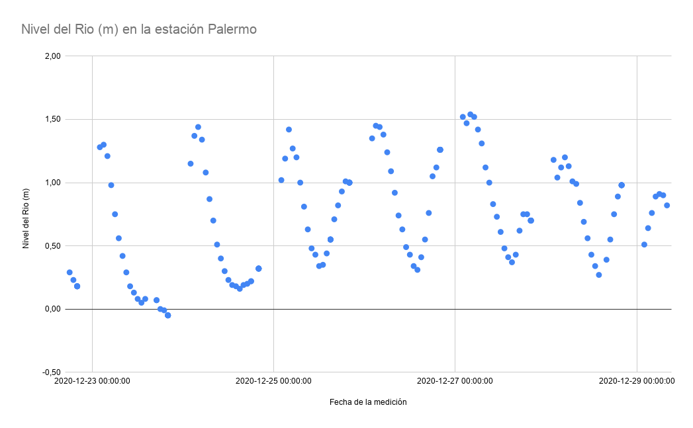

# Datos Meteorológicos de Aysa

## Introducción

Aysa a través de [este](https://www.aysa.com.ar/Que-Hacemos/estaciones-meteorologicas/datos#) sitio web provee información sobre distintas variables meteorológicas en distintas zonas de buenos aires. Allí se encuentran datos del último día pero se pierden los datos históricos, utilizando un [simple script](https://github.com/mathigatti/aysa-datos-meteorologicos/blob/main/downloader.gs) almaceno estos datos y actualizo [esta planilla](https://docs.google.com/spreadsheets/d/1qgud2AiHhAy-r8yfP5FOSSDSZ3H0ILY-G6xlpFhweug/edit?usp=sharing) cada hora para así generar un  extenso dataset público de los datos meteorológicos de Buenos Aires. 

Acceso al dataset público: [aca](https://docs.google.com/spreadsheets/d/1qgud2AiHhAy-r8yfP5FOSSDSZ3H0ILY-G6xlpFhweug/edit#gid=0)

## Variables provistas

- Velocidad del Viento (km/h)
- Temperatura (ºC)
- Velocidad del Viento (ráfaga) (km/h)
- Presión (hPa)
- Nivel del Río (m)	
- Lluvia Acumulada Diaria (mm)
- Humedad (%)
- Dirección del Viento (°)

## Detalles técnicos

Este programa funciona a partir de una simple planilla de Google Sheet a la cual se le configuró un _Editor de secuencias de comandos_ con _Google App Script_ para que corra [este script](https://github.com/mathigatti/aysa-datos-meteorologicos/blob/main/downloader.gs) y se le puso un trigger para que se ejecute cada una hora la función `update_google_sheet()`
